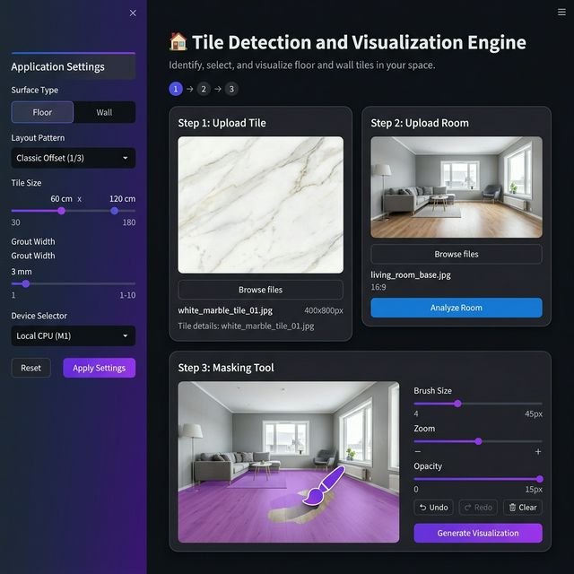
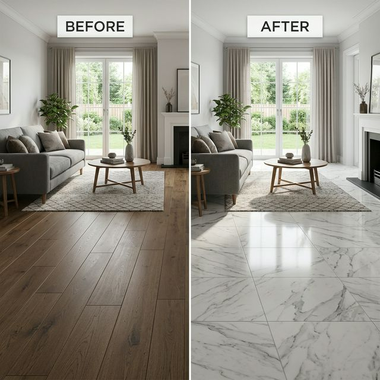
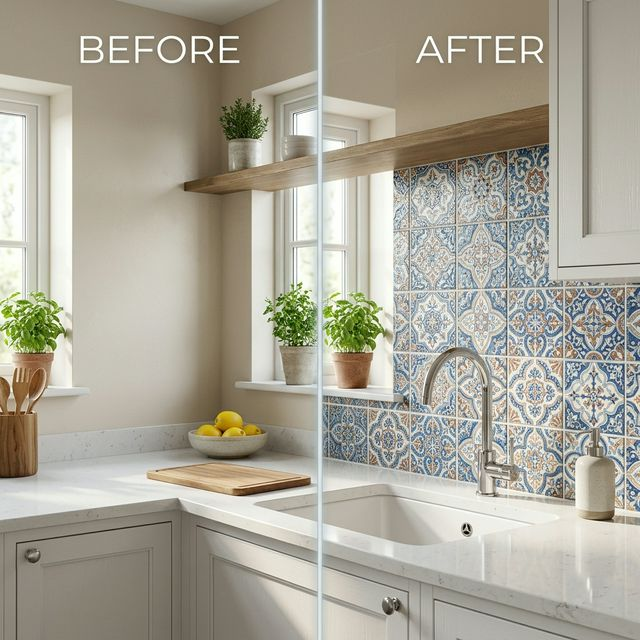
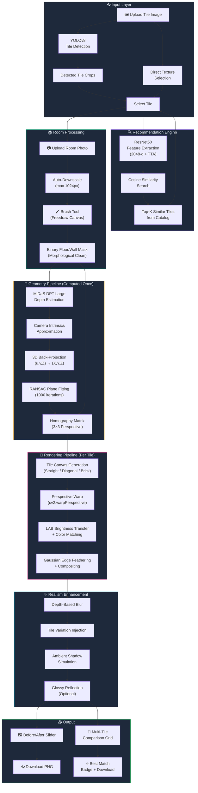

<div align="center">

# 🏠 Tile Detection and Visualization Engine

### *Detect, recommend, and visualize tiles on any surface — from a single photograph.*

---

</div>

## 🎥 Demo

<table>
<tr>
<td align="center"><b>🖥️ Web Application Interface</b></td>
</tr>
<tr>
<td></td>
</tr>
</table>

<table>
<tr>
<td align="center"><b>🏗️ Floor Visualization</b></td>
<td align="center"><b>🧱 Wall Visualization</b></td>
</tr>
<tr>
<td></td>
<td></td>
</tr>
</table>

---

## 🧠 What This Project Does

This engine transforms a **single room photograph** into a photorealistic tile visualization — no 3D scanning, no CAD software, no manual polygon selection. Just upload a photo, paint the surface with a brush, and see tiles rendered with accurate **depth, perspective, and lighting** in seconds.

- 🔍 **Detect** individual tiles from any image using a custom-trained YOLOv8 model
- 🎯 **Recommend** visually similar tiles from a catalog via ResNet50 deep embeddings
- 🖌️ **Select** any floor or wall surface with an intuitive brush-based masking tool
- 📐 **Estimate depth** and reconstruct 3D geometry for perspective-correct tile mapping
- 💡 **Blend** tiles with room lighting, shadows, and color temperature automatically
- 🔲 **Compare** 2–5 tile options side-by-side on identical room geometry
- ✨ **Enhance realism** with depth blur, tile variation, edge feathering, and ambient shadows

---

## 🏗️ System Architecture



---

## 🔬 Architecture Deep Dive

### 1️⃣ Tile Detection — YOLOv8

**Module:** `detection/detector.py`

| Aspect | Detail |
|---|---|
| **What** | Detects and crops individual tiles from a user-uploaded image |
| **Model** | Custom-trained YOLOv8 (`models/tile_yolov8_best.pt`) |
| **How** | Runs inference → filters `"tiles"` class → crops by bounding box → saves as UUID JPEG |

**Why YOLOv8?** — Real-time single-pass detection. Unlike two-stage detectors (Faster R-CNN), YOLO provides sub-second inference even on CPU, critical for an interactive Streamlit app.

```python
model = YOLO("models/tile_yolov8_best.pt")
results = model(image_path)[0]
for box in results.boxes.xyxy:
    x1, y1, x2, y2 = map(int, box)
    crop = image[y1:y2, x1:x2]  # Individual tile crop
```

---

### 2️⃣ Visual Recommendation — ResNet50 + Cosine Similarity

**Modules:** `recommendation/embedding.py` · `recommendation/similarity.py`

| Aspect | Detail |
|---|---|
| **Embedding** | ResNet50 (final FC replaced with `Identity()`) → 2048-d feature vector |
| **TTA** | 4 rotations (0°, 90°, 180°, 270°) averaged → **orientation-invariant** features |
| **Normalization** | L2-normalized for cosine similarity |
| **Catalog** | `tile_embeddings.npy` (precomputed) + `df_balanced.csv` (metadata) |

**Why TTA (Test-Time Augmentation)?** — Tiles can appear in any rotation in photos. Averaging embeddings over 4 rotations makes the similarity search **rotation-invariant**, so a tile rotated 90° still matches its original.

**Why cosine similarity over Euclidean?** — Cosine similarity measures directional alignment in feature space, making it robust to brightness/contrast differences between tile images.

```python
# TTA: 4-rotation averaging for orientation-invariant embeddings
features = model(torch.stack([transform(img.rotate(r)) for r in [0, 90, 180, 270]]))
embedding = l2_normalize(features.mean(axis=0))

# Catalog search
similarities = cosine_similarity([query_embedding], catalog_features)[0]
top_k = similarities.argsort()[::-1][:k]
```

---

### 3️⃣ Interactive Surface Masking — Brush Tool

**Module:** `app.py` (via `streamlit-drawable-canvas`)

| Aspect | Detail |
|---|---|
| **Tool** | Freedraw brush with configurable size (10–80px) and opacity |
| **Extraction** | Canvas RGBA alpha channel → binary mask (`alpha > 10`) |
| **Cleanup** | Morphological close (15×15 kernel, 3 iters) → open (5×5, 1 iter) |
| **Threshold** | Strict binary (0 or 255), minimum 1% coverage |

**Why brush over polygon tools?** — Floor areas often have irregular boundaries (furniture edges, rug corners). A freedraw brush gives intuitive, painterly control without requiring precise click-by-click polygon tracing.

**Why morphological cleanup?** — Brush strokes leave gaps between passes. `MORPH_CLOSE` fills these gaps, while `MORPH_OPEN` removes isolated noise pixels, producing a clean, connected mask.

---

### 4️⃣ Depth Estimation — MiDaS DPT-Large

**Module:** `visualization/depth_estimation.py`

| Aspect | Detail |
|---|---|
| **Model** | MiDaS DPT-Large (Vision Transformer backbone via `torch.hub`) |
| **Output** | Per-pixel *inverse depth* map (closer = larger value) |
| **Caching** | Model loaded once, cached globally in `_midas_model` |
| **Functions** | `estimate_depth()` → raw | `normalize_depth()` → [0,1] | `visualize_depth()` → INFERNO colormap |

**Why MiDaS DPT-Large?** — It's the highest-accuracy monocular depth estimator available without fine-tuning. The Vision Transformer backbone captures long-range spatial relationships that CNNs miss, producing smooth, consistent depth maps critical for plane fitting.

**Why monocular depth?** — The entire premise of this system is working from a **single photograph**. Stereo depth requires two images; LiDAR requires hardware. MiDaS extracts geometric structure from learned visual priors.

---

### 5️⃣ 3D Plane Geometry — RANSAC + Homography

**Module:** `visualization/plane_geometry.py`

| Mode | Method |
|---|---|
| **Floor** | Camera intrinsics → 3D back-projection → RANSAC plane fit (1000 iters) → Homography |
| **Wall** | Simplified 2D affine — maps tile canvas directly to mask bounding box |

#### Floor Mode Pipeline:

```
Step 1: Approximate camera intrinsics
        focal_length ≈ max(width, height) × 1.2
        cx, cy = width/2, height/2

Step 2: Back-project masked pixels to 3D
        X = (u - cx) × Z / fx
        Y = (v - cy) × Z / fy
        Z = depth_map[v, u]

Step 3: RANSAC plane fitting
        → Sample 3 random 3D points
        → Fit plane: ax + by + cz + d = 0
        → Count inliers within threshold
        → Repeat 1000 times, keep best

Step 4: Compute homography
        → Project tile canvas corners through fitted plane
        → cv2.getPerspectiveTransform() → 3×3 matrix
```

**Why RANSAC?** — Floor pixels include outliers (furniture legs, shadows, depth estimation errors). RANSAC robustly fits a plane by iteratively sampling and rejecting outliers — unlike least-squares which would be skewed by every bad pixel.

**Why not use wall mode for floors?** — Floors recede into the distance, creating perspective foreshortening. A 2D affine transform would make tiles appear the same size near and far. The 3D pipeline ensures tiles **shrink** with distance, matching the room's vanishing point.

---

### 6️⃣ Tile Rendering — Pattern Engine

**Module:** `visualization/tile_renderer.py`

| Pattern | Method | Description |
|---|---|---|
| **Straight** | `_create_straight_canvas()` | Standard rectangular grid with grout lines |
| **Diagonal** | `_create_diagonal_canvas()` | Tiles rotated 45° in diamond layout |
| **Brick** | `_create_brick_canvas()` | Running bond — alternating rows offset by half tile width |

Each pattern generates a **bird's-eye tile canvas** with configurable grout (width + color), then warps it via `cv2.warpPerspective()` using the homography matrix.

**Why bird's-eye-view first?** — Creating tile patterns in an orthographic (flat) view is geometrically trivial — just grids and offsets. The homography matrix then handles all the complexity of perspective projection in a single warp operation.

---

### 7️⃣ Lighting & Blending — LAB Color Space

**Module:** `visualization/lighting_blender.py`

| Step | Function | What it does |
|---|---|---|
| 1 | `extract_brightness_map()` | Extracts floor luminance from LAB L-channel → ratio map centered at 1.0 |
| 2 | `apply_lighting()` | Multiplies tile pixels by brightness ratio → tiles inherit room shadows/highlights |
| 3 | `color_match_tile()` | Partial LAB color transfer at configurable strength → warm rooms get warm tiles |
| 4 | `feather_edges()` | Gaussian-blurred eroded mask → smooth gradient at boundaries |
| 5 | `composite()` | `result = original × (1−α) + lit_tile × α` |

**Why LAB color space?** — LAB separates luminance (L) from color (a, b). This lets us transfer **brightness patterns** (shadows under tables, light from windows) independently from color. RGB mixing would shift tile hues uncontrollably.

**Why feathered edges?** — Hard mask boundaries create visible "pasted-on" artifacts. Gaussian feathering creates a smooth alpha gradient at the mask edge, blending the tile naturally into surrounding surfaces.

---

### 8️⃣ Multi-Tile Comparison Engine — Geometry Reuse

**Module:** `visualization/multi_tile_engine.py`

The key insight: the expensive pipeline steps (depth estimation, RANSAC, homography, lighting analysis) are **tile-independent**. They depend only on the room image and mask.

```python
@dataclass
class GeometryCache:
    norm_depth: np.ndarray        # Normalized depth map (H,W)
    homography: np.ndarray        # 3×3 perspective matrix
    feathered_mask: np.ndarray    # Soft alpha mask (H,W)
    brightness_map: np.ndarray    # Per-pixel brightness multiplier
    floor_stats: dict             # LAB color statistics
    surface_type: str             # 'floor' or 'wall'
    build_time_s: float           # Wall-clock time (seconds)
```

```
build_geometry_cache()              ← Runs ONCE (~15s)
  ├─ MiDaS depth estimation
  ├─ RANSAC floor plane fitting
  ├─ Homography computation
  └─ Lighting analysis

render_single_tile_from_cache()     ← Runs per tile (~2s each)
  ├─ Create tile canvas with pattern
  ├─ Warp using cached homography
  ├─ Apply cached brightness map
  └─ Composite with cached feathered mask
```

**Performance impact:**

| Tiles | Without cache | With geometry cache | Savings |
|---|---|---|---|
| 2 tiles | ~32s | ~18s | **44%** |
| 3 tiles | ~48s | ~20s | **58%** |
| 5 tiles | ~80s | ~24s | **70%** |

---

### 9️⃣ Realism Enhancements — Post-Processing

**Module:** `visualization/lighting_blender.py` (integrated into pipeline)

| Enhancement | What it does | Why |
|---|---|---|
| **Depth-based blur** | Blurs far tiles progressively | Simulates camera depth of field — distant objects appear softer |
| **Tile variation** | Random ±% brightness/contrast per tile | Breaks the digital "copy-paste" uniformity; real tiles vary slightly |
| **Edge feathering** | Gaussian alpha falloff at mask edges | Eliminates hard cutoff lines between tile and original surface |
| **Ambient shadows** | Darkening in corners and along edges | Mimics ambient occlusion — where walls meet floors, light is blocked |
| **Glossy reflection** | Faint environment reflection overlay | Simulates glazed/polished tile surfaces catching room light |

These are controlled by a single **Realism Strength** slider (0.0 → classic rendering, 1.0 → full post-processing).

---

### 🔮 AI Realistic Mode — ControlNet (Future)

**Module:** `visualization/ai_realistic_mode.py`

**Status:** 🔴 **Placeholder — Not Yet Implemented**

Planned: Use the MiDaS depth map as ControlNet conditioning + Stable Diffusion Inpainting for photorealistic material rendering — specular reflections, marble veins, grout shadows, global illumination. Will supplement (not replace) the deterministic CV pipeline.

---

## 🔍 Key Features

| Feature | Description |
|---|---|
| 🏠 **Perspective-correct rendering** | RANSAC plane + homography ensures tiles follow the room's vanishing point |
| 📐 **Depth-aware tiling** | MiDaS depth map scales tiles realistically — far tiles appear smaller |
| 💡 **Lighting-aware blending** | Shadows and highlights transfer onto tile textures via LAB color space |
| 🖌️ **Brush-based masking** | Freedraw brush — no complex polygon tools needed |
| 🔲 **Multi-tile comparison** | Apply 2–5 tiles at once; geometry computed once and shared |
| 🎨 **Three tile patterns** | Straight grid, 45° diagonal, and brick running bond |
| 🧱 **Wall mode** | Simplified 2D affine warp for vertical surfaces |
| ✨ **Realism post-processing** | Depth blur, tile variation, ambient shadows, glossy reflection |
| ↔️ **Before/After slider** | Interactive drag comparison between original and result |
| 📥 **Export** | Download each result as PNG, individually per tile in comparison mode |

---

## 📂 Project Structure

```
Tile_visual/
├── app.py                          # 🖥️ Streamlit UI — main entry point
├── main.py                         # Legacy FastAPI API server
├── requirements.txt
│
├── detection/                      # ──── Tile Detection Module ────
│   ├── __init__.py
│   └── detector.py                 # YOLOv8 inference + tile cropping
│
├── recommendation/                 # ──── Visual Similarity Module ────
│   ├── __init__.py
│   ├── embedding.py                # ResNet50 feature extraction with TTA
│   └── similarity.py               # Cosine similarity search against catalog
│
├── visualization/                  # ──── Core Rendering Engine ────
│   ├── __init__.py                 # Public API exports
│   ├── visualization_engine.py     # Single-tile pipeline orchestrator
│   ├── multi_tile_engine.py        # ★ Multi-tile comparison engine
│   ├── depth_estimation.py         # MiDaS DPT-Large depth mapping
│   ├── floor_segmentation.py       # DeepLabV3 floor detection (auto mode)
│   ├── plane_geometry.py           # RANSAC plane fitting + homography
│   ├── tile_renderer.py            # Tile canvas generation + perspective warp
│   ├── lighting_blender.py         # LAB color matching + edge feathering
│   └── ai_realistic_mode.py        # ControlNet placeholder (future)
│
├── models/                         # ──── Pre-trained Weights & Data ────
│   ├── tile_yolov8_best.pt         # YOLOv8 tile detection (~6 MB)
│   ├── tile_embeddings.npy         # Precomputed catalog embeddings (~8.5 MB)
│   ├── tile_labels.npy             # Catalog image filenames
│   └── df_balanced.csv             # Catalog metadata
│
├── tests/                          # ──── Unit Tests ────
│   ├── test_visualization.py       # 22 pipeline tests
│   └── test_multi_tile.py          # 10 multi-tile engine tests
│
├── assets/                         # ──── Demo Images ────
│   ├── demo_base_website.png
│   ├── demo_floor_visual.png
│   └── demo_wall_visual.png
│
├── utils/                          # Legacy utility wrappers
├── templates/                      # Legacy FastAPI HTML templates
├── static/                         # Static assets
└── crops/                          # YOLOv8 crop output directory
```

---

## 🧪 Core Technologies

| Component | Technology | Purpose |
|---|---|---|
| **UI** | Streamlit + streamlit-drawable-canvas | Interactive web UI with brush tool |
| **Tile Detection** | YOLOv8 (Ultralytics) | Real-time object detection for tile extraction |
| **Feature Extraction** | ResNet50 (torchvision) | 2048-d embedding vectors for visual similarity |
| **Depth Estimation** | MiDaS DPT-Large (torch.hub) | Monocular per-pixel depth maps |
| **Floor Segmentation** | DeepLabV3-ResNet101 (torchvision) | Auxiliary auto floor detection |
| **3D Geometry** | NumPy + OpenCV | RANSAC plane fitting, homography, perspective warp |
| **Color Science** | OpenCV LAB conversion | Lighting transfer, color temperature matching |
| **Similarity Search** | scikit-learn | Cosine similarity computation |
| **Deep Learning** | PyTorch + torchvision + timm | Model inference infrastructure |

---

## ▶️ How to Run

### Prerequisites

- **Python 3.10+** (tested on 3.12.5)
- **~2 GB disk space** (MiDaS + DeepLabV3 download ~750 MB on first launch)
- **GPU optional** — CUDA dramatically speeds depth estimation (~15s → ~2s)

### Installation

```bash
# Clone the repository
git clone <repository-url>
cd Tile_visual

# Create virtual environment
python -m venv .venv

# Activate (Windows)
.\.venv\Scripts\Activate.ps1

# Activate (Linux/Mac)
source .venv/bin/activate

# Install dependencies
pip install -r requirements.txt

# Optional: GPU acceleration (CUDA 11.8)
pip install torch torchvision --index-url https://download.pytorch.org/whl/cu118
```

### Launch the App

```bash
streamlit run app.py
# → Opens at http://localhost:8501
```

### Run Tests

```bash
# All 32 tests
python -m pytest tests/ -v

# Only multi-tile tests
python -m pytest tests/test_multi_tile.py -v
```

---

## 🎛️ Configuration

| Setting | Default | Range | Description |
|---|---|---|---|
| **Surface Type** | `floor` | floor / wall | Floor = 3D depth perspective · Wall = flat 2D |
| **Layout Pattern** | `straight` | straight / diagonal / brick | Tile arrangement pattern |
| **Tile Size** | `0.6 m` | 0.2–1.2 m | Physical tile dimension (affects perspective scale) |
| **Grout Width** | `2 px` | 0–8 px | Width of grout lines |
| **Grout Color** | `#3C3C3C` | Any hex | Grout line color |
| **Edge Feather** | `15 px` | 5–40 px | Gaussian blur at mask boundaries |
| **Color Match** | `0.25` | 0.0–1.0 | LAB color temperature transfer strength |
| **Realism Strength** | `0.5` | 0.0–1.0 | Post-processing intensity (0 = classic, 1 = full) |
| **Tile Variation** | `0.05` | 0.0–0.15 | Random brightness/contrast per tile |
| **Depth Blur** | `0.4` | 0.0–1.0 | Blur far tiles to simulate depth of field |
| **Glossy Reflection** | `Off` | On/Off | Faint room reflection on tile surface |
| **Brush Size** | `35` | 10–80 | Brush radius for painting |
| **Device** | `auto` | auto / cpu / cuda | Inference device |

---

## 📸 Results & Output

**Single Mode** — Renders the selected tile with perspective, lighting, and realism post-processing. Includes an interactive before/after drag slider and PNG download.

**Comparison Mode** — All 2–5 tiles rendered on identical geometry, displayed side-by-side. The ⭐ **Best Match** badge highlights the highest similarity score. Each result has its own download button.

### ⚡ Performance

| Component | CPU | GPU |
|---|---|---|
| MiDaS Depth Estimation | ~8–15s | ~1–2s |
| YOLOv8 Detection | ~2–5s | <1s |
| ResNet50 Embedding | ~1–2s | <0.5s |
| Tile Render + Warp | ~0.5–1s | ~0.5s |
| Lighting + Compositing | ~0.3–0.5s | ~0.3s |
| **Single tile total** | **~12–25s** | **~3–5s** |

| Multi-Tile | Without Cache | With Cache | Savings |
|---|---|---|---|
| 2 tiles | ~32s | ~18s | 44% |
| 3 tiles | ~48s | ~20s | 58% |
| 5 tiles | ~80s | ~24s | 70% |

---

## 🚧 Future Improvements

| Area | Planned Enhancement |
|---|---|
| 🎨 **AI Realism** | ControlNet + Stable Diffusion for photorealistic material rendering |
| 🏆 **Auto Tile Ranking** | Score tiles by lighting compatibility and texture coherence |
| 💡 **HDR Lighting** | Shadow casting and specular highlight prediction |
| 📱 **Mobile UI** | Responsive touch-based brushing for tablets |
| 🧠 **Auto Segmentation** | SAM-based automatic floor/wall detection without manual brushing |

---

## 🔧 Troubleshooting

| Issue | Solution |
|---|---|
| First run is very slow | MiDaS + DeepLabV3 download ~750 MB — subsequent runs use cache |
| `CUDA out of memory` | Set Device to `cpu` in the sidebar |
| Tiles look flat / no perspective | Switch Surface Type from `wall` → `floor` |
| Mask coverage too low | Paint more generously — threshold is 1% of image area |
| Comparison grid shows 1 result | Add 2+ tiles before clicking Apply |
| `No module named 'streamlit_drawable_canvas'` | `pip install streamlit-drawable-canvas` |
| `ModuleNotFoundError: timm` | `pip install timm` |
| Colors don't match the room | Increase the Color Match slider |

---

<div align="center">

**Tile Detection and Visualization Engine**

*YOLOv8 · ResNet50 · MiDaS DPT-Large · RANSAC · Homography · LAB Color Science · Multi-Tile Comparison*

Made with ❤️ using Python, PyTorch & OpenCV

</div>
